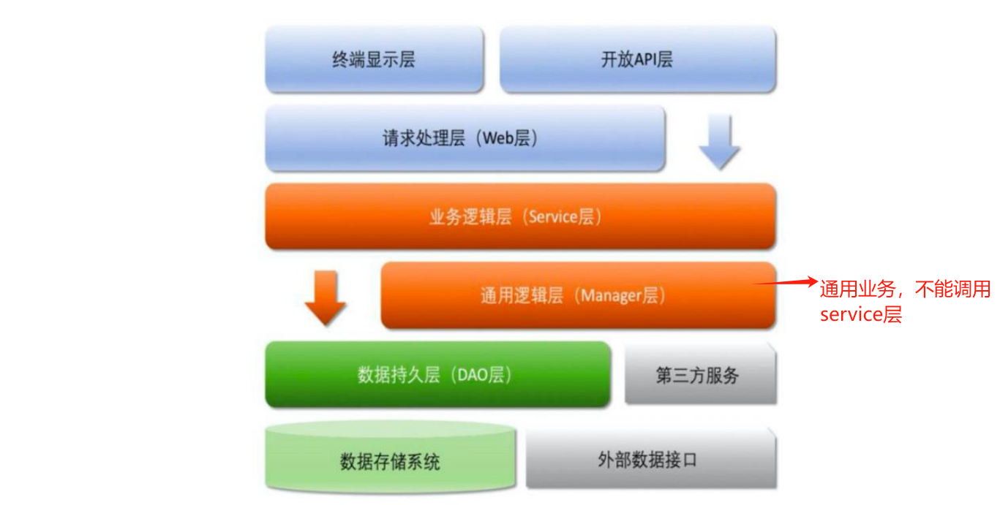

## crud或者其他底座

## 模块划分

* swak-tools : 封装简单的工具类，比如日期，复制等
* swak-client: 存放通用异常，base，给rpc 调用等

## why
* 发现很多公司crud的基础包都不会搞

## 按正常的三层模型
* web service dao
* web层做接口验证和返回，拦截等
* service层做业务逻辑
* dao层做db

### 统一
* 统一接口返回比如app，web端的返回格式。
* 包括分页格式，请求格式
* 包括dao层如何做分页，dao的中间件

## 一般微服务的工程结构

* manager层：主要是通用业务下放，比如聚合db操作减少事务范围，比如第三方调用，比如某些通用业务给service调用等。为了防止service层的无线扩张。
* 关于DO BO VO DTO 的使用原则，尽量避免，
* 优先使用如果是封装请求参数 使用req结尾，如果是返回对象使用res结尾，如果数据库实体直接使用对象名称
* 如果中间对象可以加BO结尾。
* 不必要的service层接口可以去掉，直接controller调用service就行。负责的系统看情况。

## 是否需要支持国家化
* 没必要就不处理

## 通用业务异常规范
* 参考阿里开发手册

## 架构

### 小公司
* 所有的请求经过网关 ---> 后端服务
* 没有注册中心服务发现，全经过网关调用http服务，可能公司就一个网关

