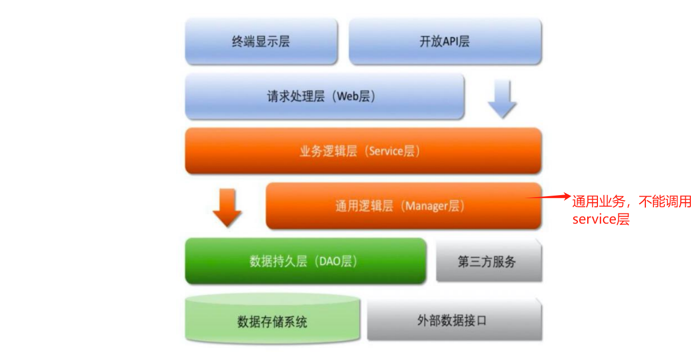

## crud或者其他底座

## 模块划分

* swak-tools : 封装简单的工具类，比如日期，复制等
* swak-client: 存放通用异常，base，给rpc 调用等

## why
* 发现很多公司crud的基础包都不会搞

## 按正常的三层模型
* web service dao
* web层做接口验证和返回，拦截等
* service层做业务逻辑
* dao层做db

### 统一
* 统一接口返回比如app，web端的返回格式。
* 包括分页格式，请求格式
* 包括dao层如何做分页，dao的中间件

## 一般微服务的工程结构
